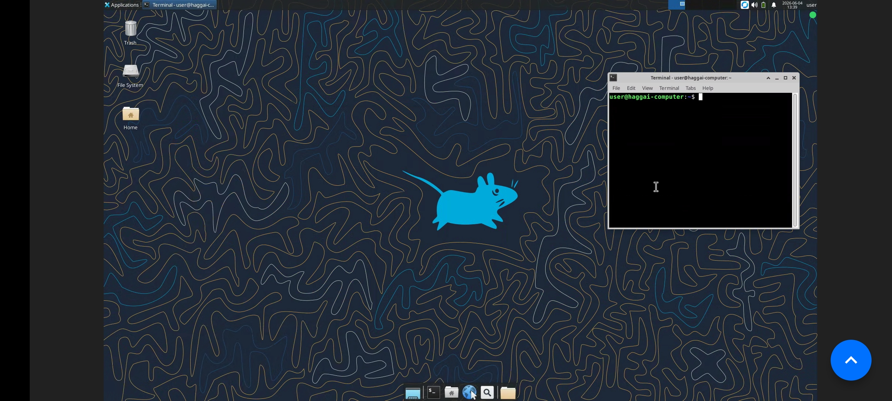

# haggai_computer

<p align="center">
  
  <br>
  <sub><em>One of these desktops — Haggai's — live on his Android phone over RustDesk Direct IP.</em></sub>
</p>

> **Turn one powerful server into many private Linux desktops — one per person —
> each reached over its own RustDesk connection.** Everyone streams pixels from
> anywhere (phone or laptop, even on a thin link); the server does all the compute,
> storage, and downloading. Every desktop is a full, persistent Ubuntu machine,
> isolated from the others and from the host.

Each desktop is a **Docker container** running a real **KDE Plasma desktop**, reached over
**RustDesk** in **Direct IP Access** mode — straight to your box's public IP, with
**no relay, no rustdesk.com account, and no Cloudflare** (sovereign by design). Each
is pre-loaded with a heavy dev / reverse-engineering / data toolchain so **OpenAI
Codex** can do real work and the user can `git push`.

This repository provisions **one such desktop — Haggai's.** He's in a Yeshiva on a
thin link, so he downloads nothing: the big image builds once on this box and he
just streams the screen. Aim it at anyone else and it's their machine instead — and
you can [**run several side by side**](#more-than-one-person) on the same server,
one RustDesk port each.

---

## Quick start (one desktop)

```bash
./setup.sh '<a-strong-password>'      # >= 12 chars, no control characters
```

That one command builds the image, starts the container, and provisions the
password. The **same password** unlocks **both** RustDesk access **and** the `user`
Linux/sudo login. The first build is **large and slow by design** (full toolchain +
Ghidra + PyTorch + RustDesk + desktop) — let it run; it prints the connect string
when it finishes.

> ⚠️ Each desktop publishes exactly **one** internet-reachable port: the
> hardened RustDesk listener (this one is `0.0.0.0:21128/tcp`). Development web
> servers and T3 Code are deliberately **not** Docker-published. From the desktop
> RustDesk client, connect first and use **Control Actions → TCP Tunneling** to
> expose a chosen guest service only on the viewer's loopback interface. See
> [`docs/SECURITY.md`](docs/SECURITY.md) for the rationale and exact workflow.

---

## How a user connects (phone + computer)

1. Install the matching **hardened RustDesk fork client** from
   [`BigBIueWhale/rustdesk_fork`](https://github.com/BigBIueWhale/rustdesk_fork).
   Stock RustDesk is not wire-compatible with this deployment's mandatory CPace
   handshake. Use a desktop build when TCP Tunneling is needed.
2. Use **Direct IP Access** — put
   ```
   <YOUR-PUBLIC-IP>:21128
   ```
   in the ID/peer field and connect. (On the same LAN, use the box's LAN IP, which
   `setup.sh` prints.)
3. Enter the password from setup. You land on the KDE Plasma desktop with full keyboard,
   mouse, and clipboard.

The connection is **straight to your box's IP** — no relay, no account. Capture is
reliable because the desktop is pure **X11/Xorg**, never Wayland (see
`docs/SECURITY.md`), and it **never blanks or locks on idle** — deliberate, so a
remote user never hits a black or locked screen.

---

## First run inside the desktop

Open **Ghostty** (the default terminal, also available with `Ctrl+Alt+T`) and:

- **OpenAI Codex**
  ```bash
  codex
  ```
  Choose **"Sign in with ChatGPT"** — it prints a URL + device code you open on your
  phone (works on a thin link). Or use an API key:
  ```fish
  set -Ux OPENAI_API_KEY 'sk-...'     # Fish universal variable; persists
  ```
  Credentials persist in `~/.codex`. Codex ships pre-configured for in-container use
  (`~/.codex/config.toml`, `sandbox_mode = "danger-full-access"`) — see
  `docs/SECURITY.md` for why.

- **GitHub / `git push`**
  ```bash
  gh auth login          # pick the device flow; open the code on your phone
  git config --global user.name  "Your Name"
  git config --global user.email "you@..."
  ```
  Then `git push` works. Auth persists in `~/.config/gh` / `~/.ssh`.

- **`sudo`** uses the same password you set. `sudo apt install <whatever>` works and
  **persists across reboots** (see Persistence).

- **Vicinae** starts with Plasma and replaces the launcher workflow. Press
  **`Meta+Space`** to toggle it; app search, clipboard history, file search,
  calculator, and its extension store are ready without a separate install.

- **T3 Code** appears in Plasma's application menu like the other GUI apps. The
  `t3` CLI is also installed. To use its web UI without publishing another Docker
  port, start it inside the desktop:
  ```fish
  t3 --host 127.0.0.1 --port 3773 --no-browser
  ```
  Then, from the connected **desktop** RustDesk client, open **Control Actions →
  TCP Tunneling** and map a free local port to remote `127.0.0.1:3773`. Open the
  resulting `http://127.0.0.1:<local-port>` on the viewer. Use the same pattern for
  a development server on `3000`, `5173`, `8080`, or any other chosen guest port.
  No additional host port is opened, and the service is carried inside the
  authenticated, encrypted RustDesk session. The Android viewer does not provide
  this TCP-tunneling GUI, so this workflow intentionally requires a desktop client.

---

## What's inside (every desktop)

The toolchain is **vendored from `BigBIueWhale/vibe_web_terminal`** (provenance copy
at [`docs/vibe_web_terminal.Dockerfile.reference`](docs/vibe_web_terminal.Dockerfile.reference)),
with its original explanatory comments kept. Highlights:

- **Languages/runtimes:** Python 3 (+ a huge pip stack incl. numpy/pandas/PyTorch
  CPU/transformers), **Node.js 22**, Go, Rust, Ruby, Perl, Lua 5.4, R, Bun, `uv`.
- **Coding agents:** **OpenAI Codex** (primary), **T3 Code** (desktop app plus
  `t3@0.0.28` CLI), and **OpenCode** (available).
- **Build/embedded:** gcc/g++/clang, cmake/ninja/meson, ARM/aarch64 cross, qemu.
- **Reverse engineering:** Ghidra, radare2, binwalk, capstone/lief/pefile, 7zz.
- **Networking/pcap:** nmap, tcpdump, tshark/termshark, scapy, wireshark tooling.
- **Docs/media/OCR:** ffmpeg, imagemagick, pandoc, LibreOffice, tesseract (+ langs),
  Playwright (Chromium+Firefox), and a comprehensive font set.
- **Editors/CLIs:** vim/neovim/emacs/micro, ripgrep/fd/bat/fzf, git/gh, tmux,
  **NeoFetch**, etc.
- **Desktop:** **KDE Plasma 5 on X11** with the standard KDE application set:
  Dolphin, Kate, Okular, Gwenview, Ark, Spectacle, System Settings, and more.
- **Shell and terminal:** **Fish** is the account's login shell and **Ghostty** is
  Plasma's default terminal.
- **Desktop GUI apps:** **Firefox**, **Google Chrome**, **VS Code**, **T3 Code**, and
  **Vicinae** are pre-installed with normal application-menu launchers. Firefox,
  Chrome, and VS Code use real `.deb`s rather than nonfunctional container snaps.

**Deliberately excluded** (your instruction): the **Qwen** CLI and the **Mistral
`vibe`** CLI (and their Ollama/air-gap scaffolding). `ttyd` is built as a tool but
**not served** — these desktops are reached by RustDesk, not a web terminal.

---

## More than one person?

The whole idea: **one server, many desktops.** Each person gets their **own**
container — its own RustDesk port, its own writable system, its own home — and they
**cannot see each other or your host.** They share only the one built image (so the
slow build happens once) and the server's CPU/RAM, which the per-desktop caps
(`cpus 8`, `mem 16g`, `pids 4096`) keep fair.

To add another, give a **fresh copy of this repo** (e.g. another `git clone`, so its
`./home` starts empty) its own name, RustDesk port, and home directory, then run its
`setup.sh`:

| Make unique per desktop | Where to set it |
|---|---|
| **Name** (e.g. `avi_computer`) | `docker-compose.yml`: the `services:` key, `container_name`, `hostname` — **and** `setup.sh`: `CONTAINER`, `SERVICE` |
| **RustDesk host port** (e.g. `21129`) | `docker-compose.yml`: the `ports:` host side — **and** `setup.sh`: `HOST_PORT` |
| **Home dir** | `docker-compose.yml`: the `volumes:` host side (keep it inside that desktop's own folder) |

Everything else (the image, the caps, the whole security posture) stays identical.
Each desktop lands on one explicit RustDesk port; add the matching allow-list line
in `docs/SECURITY.md` for that port. Guest web services remain tunnel-only.

> These three are left **explicit per deployment on purpose** (the project's
> "specific, not configurable" rule): you should always know exactly who is on which
> port. There is no hidden multi-tenant launcher to lose track of.

---

## Optional: dev mode (`--dev`) — host GPU + host Docker (advanced, off by default)

One opt-in switch, **OFF by default** — Haggai's Yeshiva deployment never uses it and
the default image is unchanged (`./setup.sh --help` lists everything). It's for when
*you* run the desktop on your own trusted GPU box, not for a locked-down friend.

```bash
./setup.sh --dev '<password>'        # host GPU (compute) + the host's Docker, together
```

`--dev` bundles two things that go together for a real dev workstation (no sub-options):

- **Host NVIDIA GPU for compute** (LLMs, PyTorch, vLLM, …) via the
  nvidia-container-toolkit. **Graphics stay 100% on the CPU** (software Xvfb framebuffer,
  OpenGL forced to software), so **0 VRAM is spent on the desktop** — all of it free for
  compute. That makes this the right tool for a **no-iGPU** server, where a *native*
  desktop would be forced onto the GPU and eat VRAM. Run LLMs directly in the desktop
  (`ollama serve`, `llama.cpp`, CUDA PyTorch) — no nested Docker needed.
- **The host's Docker** — bakes in the Docker **CLI** and bind-mounts
  `/var/run/docker.sock`, so the dev environment inside can `docker build/run/compose`
  on the **host** (incl. GPU containers); `user` gets socket access without `sudo`. It
  is **not** Docker-in-Docker — no daemon runs inside; `docker` routes to the host.

Host prerequisites (checked at launch, fail-loud if missing): the NVIDIA driver **and**
`nvidia-container-toolkit`. After launch, setup.sh verifies the GPU is visible inside
and the host daemon is reachable + `user` is in the socket group, failing loud if not.

> **⚠ Root-equivalent.** Write access to `/var/run/docker.sock` = host root. Use `--dev`
> **only** on a single-user box you fully trust — **never** for a DMZ desktop like
> Haggai's.

### `docker` inside dev mode is wrapped — it owns the leaky abstraction
Because that `docker` drives the **host** daemon, a container you start is a *sibling on
the host* in its own network namespace, not nested in the desktop. On this no-firewall
DMZ box that means `docker run -p 8000:80` publishes to the **public internet** *and*
still isn't reachable from the desktop's `localhost`. So in dev mode `docker` is the
**`docker-guard`** wrapper (`dev/docker-guard`): it **refuses** the internet-exposing
patterns (`-p`, `-P`, `--network host`, and a `docker compose` whose resolved config
publishes a host port), **warns** when a service would be unreachable, and prints the
pattern that actually works. Run **`docker haggai-help`** inside for the full model. To
run e.g. vLLM privately and reach it on `localhost`:

```bash
docker run -d --gpus all --network container:haggai_computer \
  vllm/vllm-openai:latest --model <hf-model>
curl http://localhost:8000/v1/models      # works from the desktop; NOT on the internet
```

The wrapper is a guard rail, not an airtight wall (the raw `/usr/bin/docker` bypasses
it). The airtight backstop is a host setting you choose — `/etc/docker/daemon.json` →
`{"ip":"127.0.0.1"}` so the daemon default-binds published ports to loopback. See
[`docs/SECURITY.md`](docs/SECURITY.md) §7a.

---

## Persistence — each desktop is a real, whole machine

A desktop's container is a long-lived **pet**, not a throwaway:

- **`restart: unless-stopped`** + Docker-on-boot + your BIOS "Restore AC Power Loss
  → Power On" ⇒ after any **reboot or power-cut**, the daemon restarts the **same
  container, writable layer intact**. No action needed.
- So **everything persists** across reboots/restarts — `sudo apt install` packages,
  `/tmp`, `/etc`, `/opt`, any file created anywhere — exactly like a normal computer
  (more so: stock Ubuntu clears `/tmp` on boot; here it doesn't).
- `/home/user` is **additionally** bind-mounted to **`./home`** on the host, so
  personal files persist even more robustly and you can back them up host-side.
- **Don't recreate the container in normal use.** `setup.sh` refuses to run if it
  already exists (so it can't wipe state). To pause/resume use `docker compose stop`
  / `start` — they keep everything.
- The **only** things that reset state are `./teardown.sh` (discards the writable
  layer; keeps `./home`) or a deliberate image rebuild. `./teardown.sh --purge` also
  deletes `./home`.

---

## Lifecycle

| Command | Effect |
|---|---|
| `./setup.sh '<pw>'` | Build + start + provision (first time only; refuses if it already exists). |
| `docker compose stop` / `start` | Pause / resume. Keeps **everything**. |
| `docker compose logs -f` | Watch the desktop / RustDesk logs. |
| `docker compose exec -u user haggai_computer fish` | A shell as `user` inside. |
| `./teardown.sh` | Remove the container (discards apt installs; **keeps `./home`** + image). |
| `./teardown.sh --purge` | Above **and** delete `./home` (immediate; the flag is the confirmation, no prompt). |

---

## No NVIDIA, by design

By default these containers never touch the RTX 5090: no `--gpus`, no NVIDIA runtime,
software (CPU) video encoding only. The card stays free for your own compute. (The
opt-in `--dev` mode above is the single exception — and even then it attaches the GPU
for *compute* only; graphics still render on the CPU, so the desktop spends 0 VRAM.)

---

## Reproducibility boundary

- **Pinned** (security-relevant / binary artifacts): RustDesk `1.4.7`, T3 Code
  `0.0.28`, Vicinae `0.23.1`, and Ghostty `1.3.1-0~ppa2` are SHA-256 verified and
  fail closed; the base is `ubuntu:24.04`. Ghidra, radare2/ttyd, libwebsockets,
  `7zip`, and `binwalk` retain their existing pins.
- **Tracking-upstream** (the large apt/pip/npm dev sets, Codex, gh): current-stable
  at build time — matching the upstream Dockerfile and the `personal_server` §16
  "dev toolchain is intentionally unpinned" precedent. A rebuild months later may
  pull newer tool versions; that's deliberate.

See [`docs/SECURITY.md`](docs/SECURITY.md) for the full security posture, the exact
RustDesk-port network-audit edit, the shared-password model, and optional extra
hardening.
